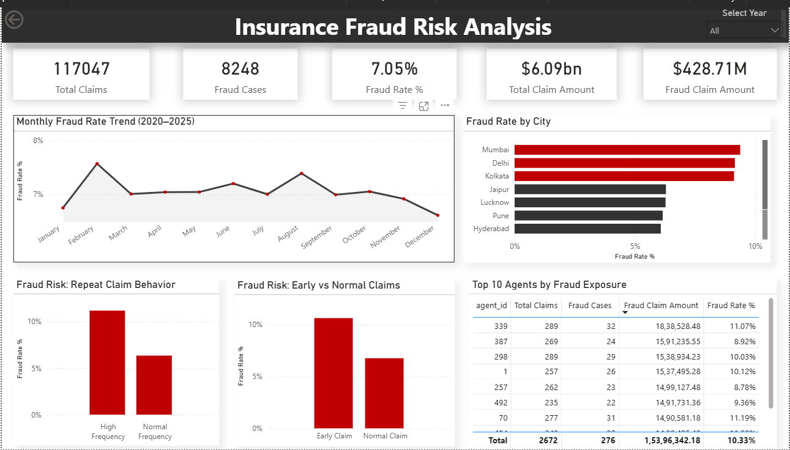

#  Insurance Fraud Risk Analysis

##  Project Overview

This project analyzes multi-year insurance claims data (2020–2025) to identify fraud patterns, high-risk entities, and behavioral red flags.

The objective is to simulate a real-world consulting-style fraud risk analysis using:

- Python (Data Cleaning & Transformation)
- MySQL (Business Querying & Risk Insights)
- Power BI (Executive Dashboarding)
- Git & GitHub (Version Control)

---

##  Business Objective

Insurance fraud leads to significant financial losses.  
This project aims to:

- Measure overall fraud exposure
- Identify high-risk agents and customers
- Detect behavioral fraud patterns
- Highlight geographic fraud concentration
- Provide a decision-support dashboard for management

---

##  Key Insights

- Overall Fraud Rate: **7.05%**
- Early Claims Fraud Rate: **10.62%** (significantly higher risk)
- High Frequency Claimants Fraud Rate: **11.19%**
- Certain agents show fraud exposure above **11%**
- Specific cities show consistently higher fraud rates

---

##  Dataset Description

The project uses structured relational datasets:

- `customers`
- `policies`
- `claims`
- `payments`

Time Range: **2020 – 2025**

---

##  Data Cleaning (Python)

Performed using Pandas & NumPy:

- Removed duplicate claim records
- Handled missing income and claim_type values
- Removed negative `days_since_policy_start`
- Validated fraud rate consistency
- Created structured cleaned datasets

Script:  
`src/01_data_cleaning.py`

---

##  SQL Analysis

Performed advanced business analysis using MySQL:

- Fraud rate by policy type
- Fraud rate by city
- Early vs Normal claim risk comparison
- High-frequency claim behavior analysis
- Top fraud-exposed agents
- Fraud-prone customers

SQL File:  
`sql/queries.sql`

---

##  Power BI Dashboard

Developed an executive-level dashboard including:

- KPI Cards (Total Claims, Fraud Rate, Fraud Exposure)
- Monthly Fraud Trend (2020–2025)
- Fraud Rate by City
- Repeat Claim Risk Analysis
- Early vs Normal Claim Risk
- Top Agents by Fraud Exposure
- Year-wise interactive slicer

Dashboard File:  
`power_bi/dashboard.pbix`

Preview:

---

##  Tools & Technologies Used

- Python (Pandas, NumPy)
- MySQL
- Power BI
- Git & GitHub

---

##  Project Structure
FinancialFraud_and_RiskAnalytics_Project/
│
├── data/
├── cleaned_data/
├── src/
├── sql/
├── power_bi/
├── README.md
├── requirements.txt

---

##  Future Enhancements

- Fraud Prediction Model (Random Forest / XGBoost)
- Feature Importance Analysis
- Risk Scoring Framework
- Deployment-ready pipeline

---

##  Author

Satvik  
Data Analyst | SQL | Python | Power BI
